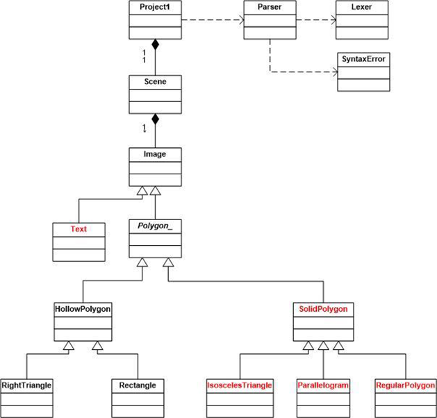

# CMSC 330: Advanced Programming Languages | Project One

Updates By: Christina Torres

CMSC 330: Advanced Programming Languages

Professor Alin Suciu

Spring 2023

Skeleton Code By: UMGC 2021

-----------

## UML Class Diagram (from assignment instructions)

----

## Developer’s Guide

1. Use directory to navigate to the file location.
2. Compile and run the main file.
    
    `javac Main.java && java Main`
    
3. Select your file with the dimensions.
    
    
    
4. See results.
    
    
    
5. **Note awesomeness happening with the color scheme and icon💪.**

-----------

## What I Learned

I learned many invaluable lessons when creating this program. I am still getting use to a GUI, so this is interesting to me. I’m great with HTML and CSS, but not so much Java GUI things. I am growing to love it though. It is quite fun to see the different attributes and panels. I learned that the window is probably the frame and the sections of it are usually scenes. There is where the different objects live.

I learned quite a bit about how language translators and compilers work. Code starts as source code. It then goes to the Lexical Analyzer which can sometimes be called scanner. It results in a token stream. This token stream is then passed through a syntactic analyzer. A parse tree is created. In some languages there is an intermediate code generated which returns intermediate code. This then goes through a final code generator in some languages. Object code is the result.

Overall, I have a better appreciation of compilers.

